# Predicción de mortalidad a 28 días en sepsis con Machine Learning

Proyecto de tesis · **Universidad Peruana Cayetano Heredia (UPCH)** — Facultad de
Ciencias e Ingeniería.

---

## Sobre el proyecto

La **sepsis** es una de las principales causas de mortalidad en las unidades de
cuidados intensivos (UCI). Identificar tempranamente a los pacientes con mayor
riesgo de fallecer permite priorizar recursos y decisiones terapéuticas.

Este trabajo desarrolla un **modelo de aprendizaje automático** que estima la
**probabilidad de muerte a 28 días** en pacientes con sepsis, a partir de
variables clínicas y de laboratorio disponibles en las primeras horas de
hospitalización. El proyecto replica y extiende el estudio de
**Zhang et al. (2024)**, evaluando además el subgrupo de pacientes con
**síndrome de disfunción cerebral aguda (SAD)** —delirium/encefalopatía
detectada con CAM-ICU—, un grupo asociado a peor pronóstico.

El resultado se entrega en dos formas:

1. Un **modelo predictivo** entrenado y calibrado (`Ensemble_top3`).
2. Una **aplicación web interactiva** (Streamlit, bilingüe español/inglés) que
   permite ingresar los datos de un paciente y obtener su probabilidad de
   mortalidad estimada, pensada como herramienta de apoyo exploratorio.

> ⚠️ Herramienta de investigación con fines académicos. **No es un dispositivo
> médico** ni sustituye el juicio clínico profesional.

---

## Resultados principales

El modelo se entrenó sobre una cohorte de **12 564 pacientes** con sepsis
extraída de MIMIC-IV v3.1 (prevalencia de muerte a 28 días = **14.3 %**).

### Selección de la cohorte

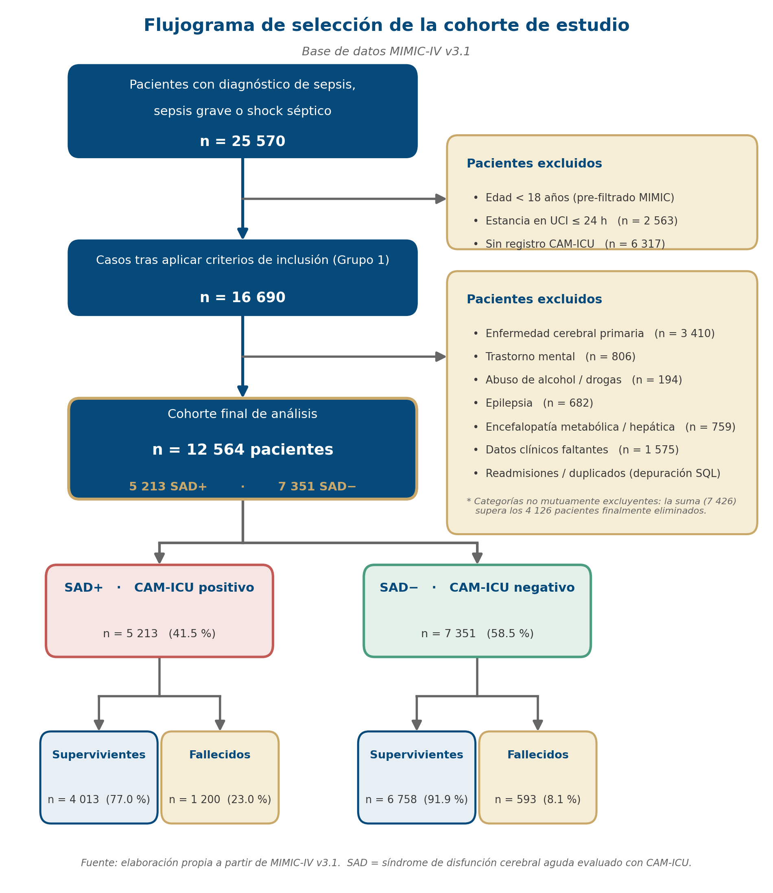

### Comparación de modelos

| Modelo | AUC (test) | IC 95 % | Sensibilidad | Especificidad | Calibración (HL p) |
|---|---|---|---|---|---|
| **Ensemble_top3** ✅ | **0.900** | [0.883 – 0.918] | 0.859 | 0.780 | 0.62 (buena) |
| Stacking_top3 | 0.907 | [0.889 – 0.924] | 0.889 | 0.750 | 0.00 (deficiente) |
| LightGBM | 0.894 | — | — | — | — |
| XGBoost | 0.892 | — | — | — | — |
| ExtraTrees | 0.885 | — | — | — | — |

Aunque el *Stacking_top3* obtuvo un AUC ligeramente superior, su **calibración
era deficiente** (la probabilidad predicha no reflejaba el riesgo real). Se
eligió como modelo final el **`Ensemble_top3`**: cruza el 90 % de AUC, está
**bien calibrado** (test de Hosmer-Lemeshow p = 0.62) y es más ligero.

### Hallazgo del subgrupo SAD

Los pacientes con disfunción cerebral aguda (SAD+, n = 5 213) presentaron una
mortalidad del **23.0 %**, frente al **8.1 %** de los pacientes sin ella
(SAD−, n = 7 351) — un riesgo **2.8× mayor**.

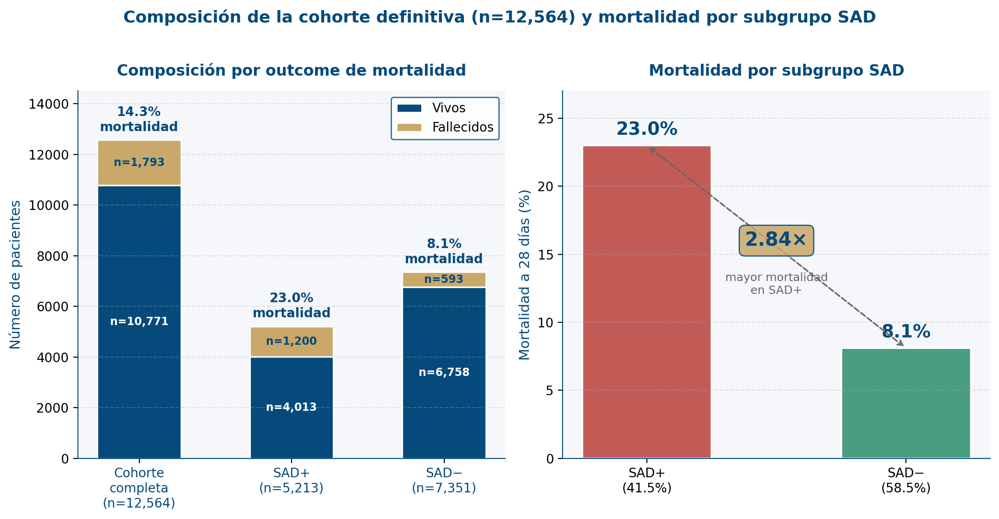

### Interpretabilidad (SHAP)

Las variables de mayor impacto en la predicción fueron la **edad**, los **días
de estancia en UCI**, la **saturación de O₂** y la razón **BUN/albúmina**.

*SHAP summary del modelo final (Ensemble_top3):*

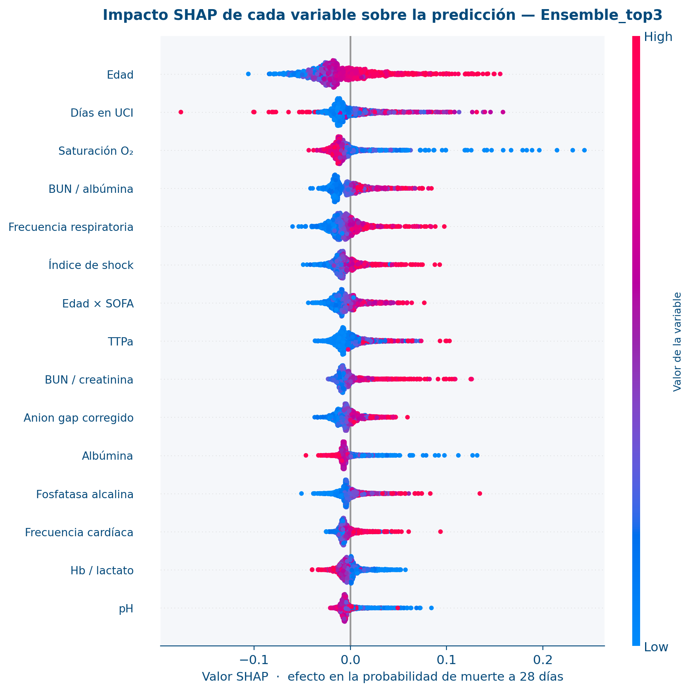

*SHAP summary del componente XGBoost del ensemble:*

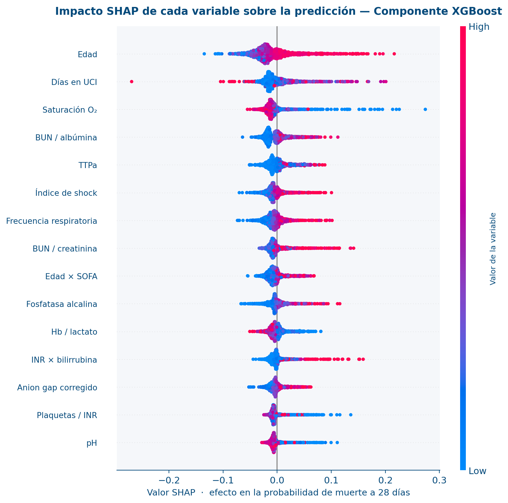

*Explicación individual de una predicción (SHAP waterfall):*

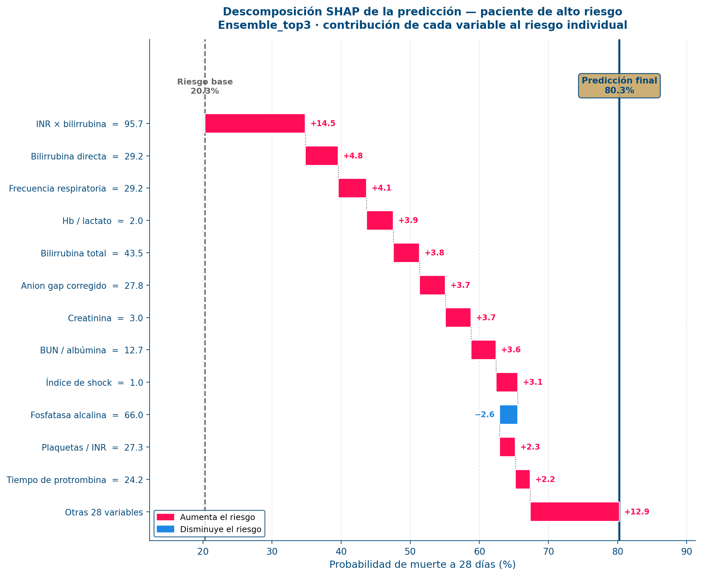

---

## Arquitectura del sistema

El sistema sigue una arquitectura por capas (metodología CRISP-DM), desde la
extracción de datos hasta el despliegue:

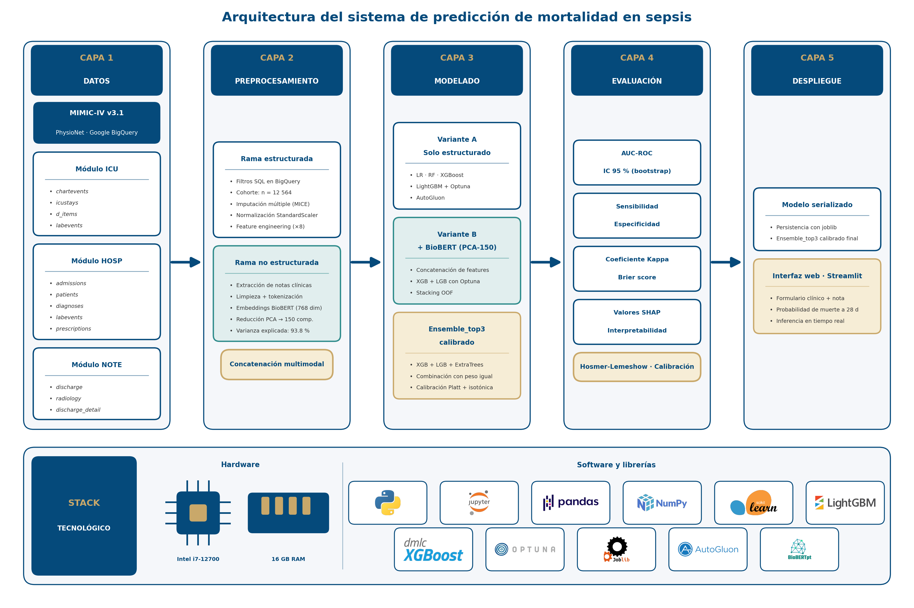

1. **Datos** — extracción desde **MIMIC-IV v3.1** (módulos ICU, HOSP y NOTE) vía
   SQL en Google BigQuery.
2. **Preprocesamiento** — construcción de la cohorte (criterios de inclusión y
   exclusión), imputación de valores faltantes (MICE), normalización
   (StandardScaler) e ingeniería de 8 variables clínicas derivadas. En paralelo,
   las notas clínicas se procesan con embeddings BioBERT reducidos por PCA.
3. **Modelado** — entrenamiento y comparación de múltiples algoritmos;
   optimización de hiperparámetros con Optuna; construcción del ensemble final.
4. **Evaluación** — AUC-ROC con intervalos de confianza por *bootstrap*,
   sensibilidad/especificidad, coeficiente Kappa, *Brier score*, test de
   calibración de Hosmer-Lemeshow e interpretabilidad con SHAP.
5. **Despliegue** — serialización del modelo (`joblib`) y aplicación web
   en Streamlit.

*Metodología CRISP-DM aplicada al proyecto:*

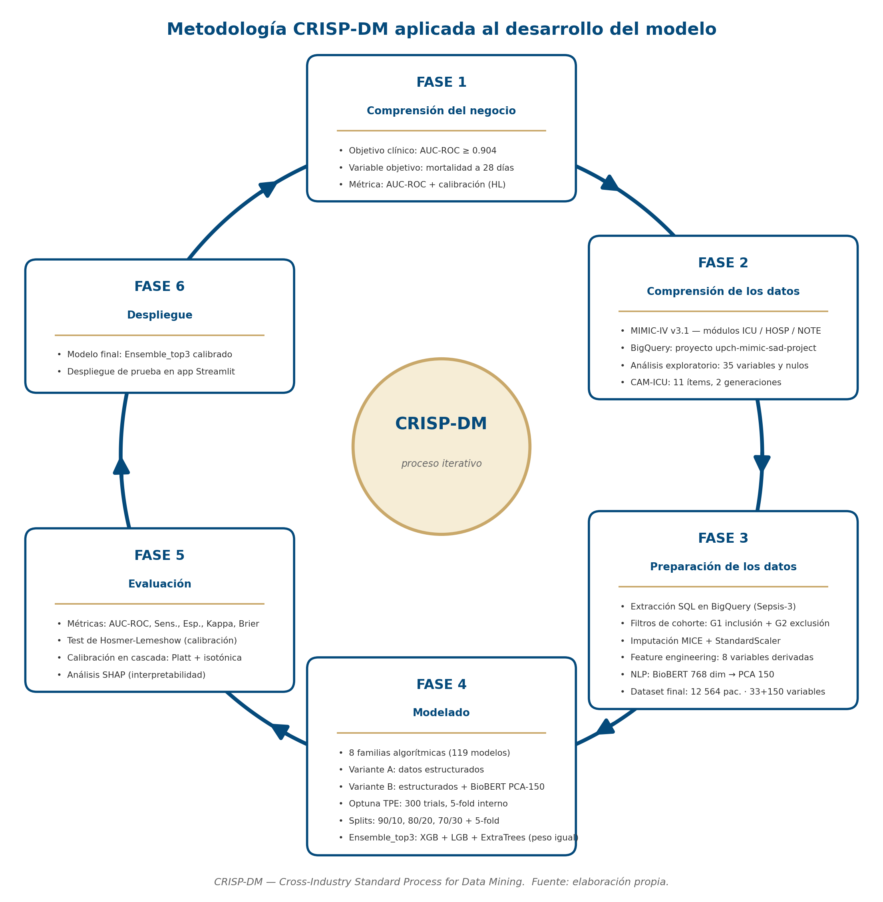

---

## Marco de evaluación

Las métricas de desempeño se interpretan sobre las siguientes escalas
conceptuales utilizadas en el documento de tesis:

*Curva ROC y significado del AUC:*

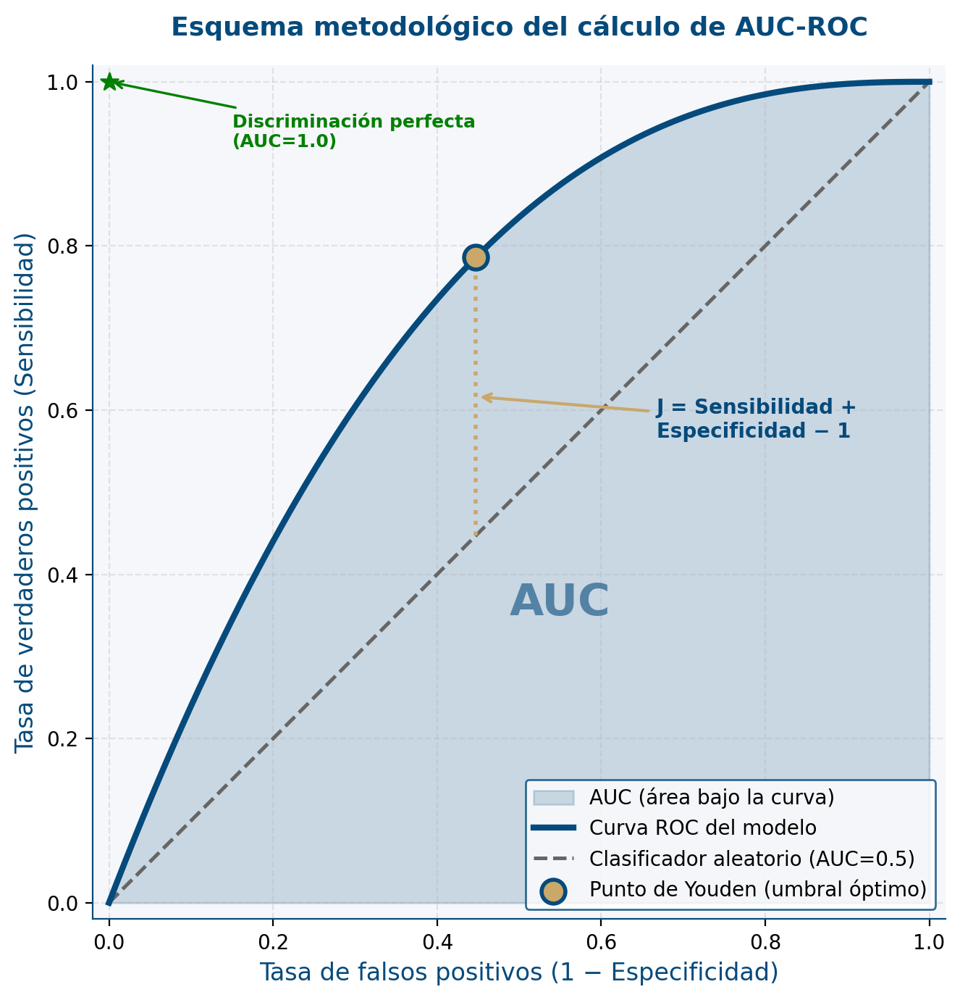

*Escala de interpretación del coeficiente Kappa de Cohen:*

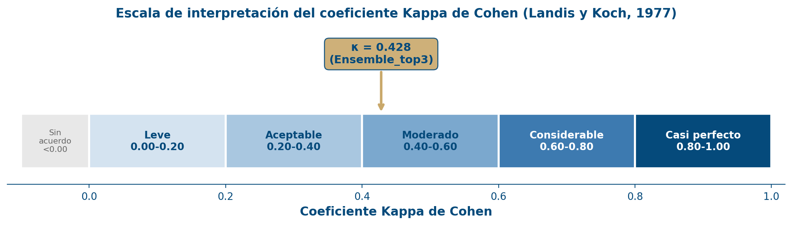

*Ciclo de la OMS para modelos de IA en salud — guía el monitoreo posterior al
despliegue:*

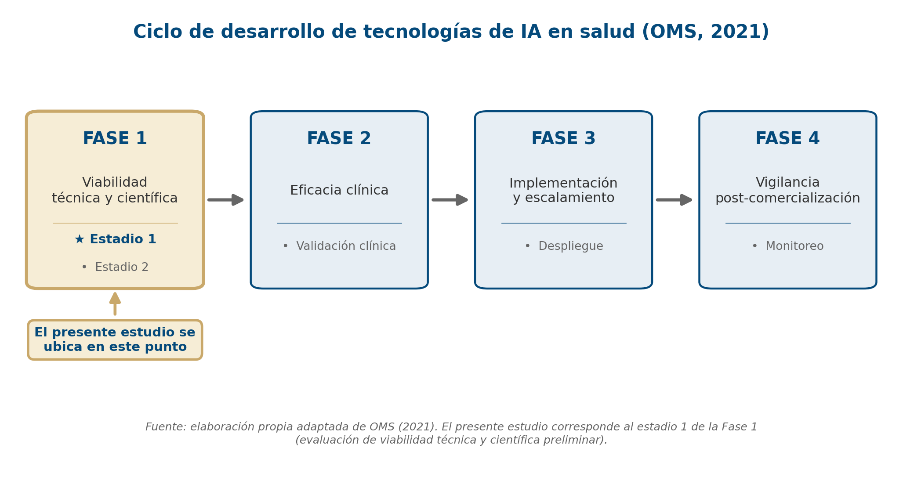

---

## Selección de variables y reducción dimensional

La importancia relativa de las variables estructurales se exploró con un
Random Forest de referencia (índice de Gini):

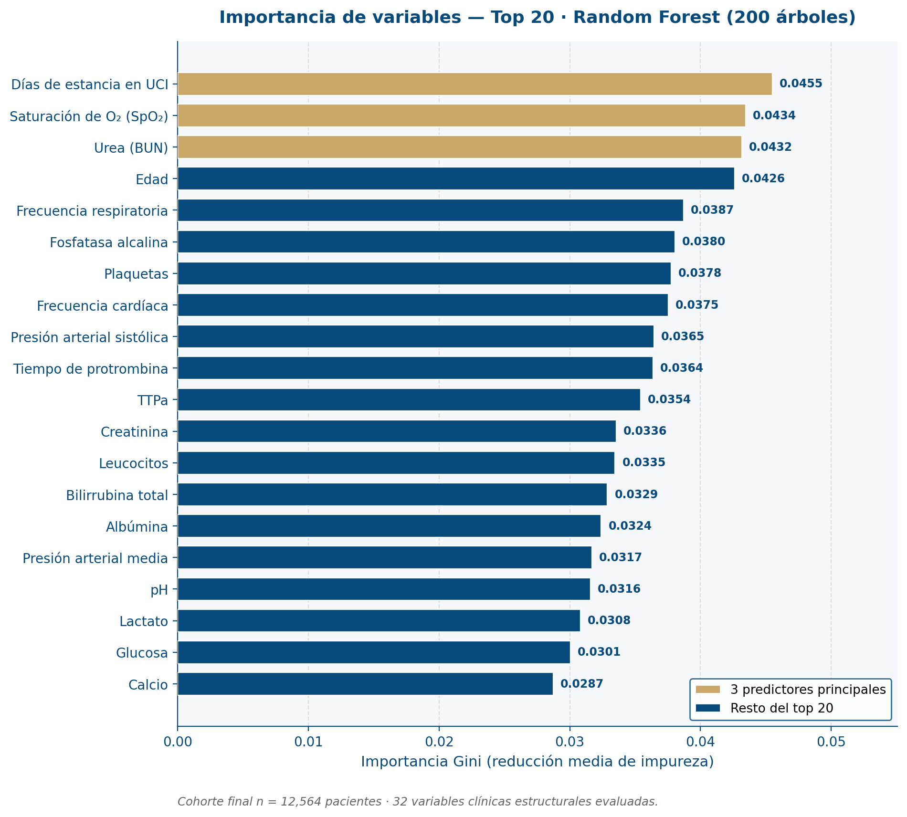

Para las notas clínicas se aplicó PCA sobre los embeddings BioBERT. La curva de
codo (*scree plot*) y la varianza acumulada justificaron el número de
componentes retenidos:

*Scree plot (autovalores por componente):*

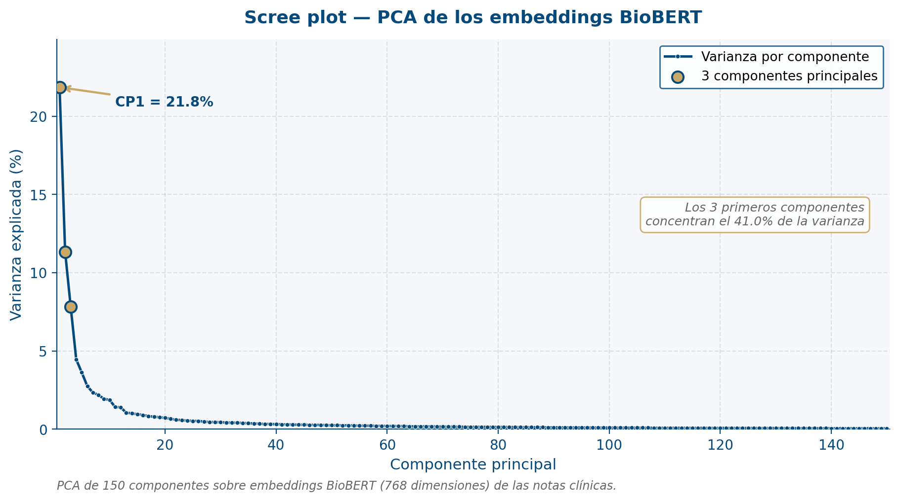

*Varianza explicada acumulada:*

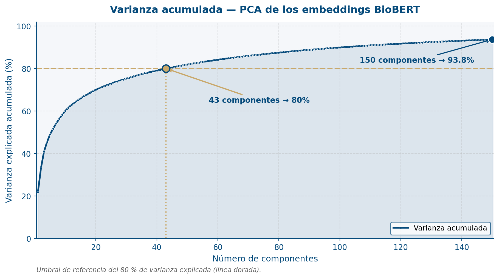

---

## ¿Cómo funciona la predicción?

Cuando se ingresan los datos de un paciente, la app aplica el pipeline del
modelo final (**`Ensemble_top3`**):

```
Variables clínicas ingresadas
        │
        ▼
1. Ingeniería de variables → se calculan 8 razones clínicas derivadas
                              (índice de shock, BUN/albúmina, Edad×SOFA, ...)
        ▼
2. Imputación (MICE)        → las variables no ingresadas se estiman a partir
                              de las correlaciones aprendidas en la cohorte
        ▼
3. Normalización            → StandardScaler
        ▼
4. Tres modelos base        → XGBoost, LightGBM y ExtraTrees predicen por
                              separado; cada uno calibrado en cascada
                              (Platt + isotónica)
        ▼
5. Ensemble                 → se promedian las 3 probabilidades calibradas
        ▼
6. Clasificación            → riesgo ALTO si P ≥ 0.135 (umbral de Youden),
                              riesgo BAJO en caso contrario
```

Gracias al imputador MICE, el modelo entrega una predicción válida **aun con
datos incompletos**; cuantas más variables reales se ingresen, más precisa es la
estimación. El modelo trabaja con **40 variables** en total: 32 clínicas
estructurales + 8 derivadas.

---

## Tecnologías utilizadas

- **Lenguaje:** Python 3.11
- **Datos:** MIMIC-IV v3.1 · SQL en Google BigQuery
- **Manipulación de datos:** pandas, NumPy
- **Machine Learning:** scikit-learn, XGBoost, LightGBM, CatBoost
- **Optimización de hiperparámetros:** Optuna
- **Balanceo de clases:** imbalanced-learn (SMOTE)
- **Interpretabilidad:** SHAP
- **NLP de notas clínicas:** BioBERT (embeddings) + PCA
- **Visualización:** Matplotlib
- **Aplicación web:** Streamlit
- **Serialización del modelo:** joblib
- **Traducción de notas (ES→EN):** deep-translator (Google Translate)

Las versiones exactas están fijadas en [`requirements.txt`](requirements.txt).

---

## Estructura del repositorio

```
proyecto-v7/
├── app_sepsis.py                  Aplicación Streamlit (interfaz + predicción)
├── src/
│   └── sepsis_model.py            Clases del modelo: EnsembleTop3, CascadeCal,
│                                  ingeniería de las 8 variables derivadas
├── scripts/                       Scripts reproducibles
│   ├── build_app_model.py         Reconstruye el modelo desplegable
│   └── gen_figuras_*_v11.py       Generación de las figuras de la tesis
├── artifacts/
│   └── figuras_conceptuales_v11/  Figuras finales de la tesis (PNG)
├── assets/logos/                  Logotipos para los diagramas
├── sepsis_v21_final.ipynb         Notebook de entrenamiento del modelo final
├── sepsis_v20.ipynb · ..._v2/v3   Notebooks de iteraciones previas
├── requirements.txt               Dependencias (Python 3.11)
└── *.md                           Documentación y bitácoras del proceso
```

> **No se versionan** (ver [`.gitignore`](.gitignore)): `data_local/` (datos
> MIMIC-IV de acceso restringido), los modelos `*.joblib` (binarios grandes),
> `app_sepsis_local/` (versiones antiguas) y artefactos temporales.

---

## Instalación

Requiere **Python 3.11**.

```bash
# 1. Clonar el repositorio
git clone https://github.com/<usuario>/<repositorio>.git
cd <repositorio>

# 2. Crear y activar un entorno virtual
python -m venv .venv
source .venv/bin/activate          # Windows: .venv\Scripts\activate

# 3. Instalar las dependencias
pip install --upgrade pip
pip install -r requirements.txt
```

---

## Uso de la aplicación

```bash
streamlit run app_sepsis.py
```

Se abre en `http://localhost:8501`. La app permite ingresar las variables
clínicas de un paciente y obtener su probabilidad estimada de muerte a 28 días,
con interfaz bilingüe (español / inglés) y desglose del cálculo.

- Casos de prueba listos para validar: [`casos_prueba_app_sepsis.md`](casos_prueba_app_sepsis.md)
- Guía de despliegue autónomo: [`app_sepsis_estructura_e_instalacion.md`](app_sepsis_estructura_e_instalacion.md)

> La app necesita el modelo entrenado en `artifacts/app_model_v21/` (ver sección
> siguiente). La traducción de la nota clínica usa internet; la predicción
> numérica funciona sin conexión.

---

## Datos (MIMIC-IV) — acceso restringido

Este proyecto usa **MIMIC-IV v3.1**, una base de datos de **acceso
credencializado** (PhysioNet). Por su acuerdo de uso de datos, **la cohorte
derivada NO se incluye en el repositorio** (`data_local/` está en `.gitignore`).

Para reproducir la extracción se requiere:
1. Credencial de PhysioNet y curso CITI "Data or Specimens Only Research".
2. Acceso a MIMIC-IV v3.1 → https://physionet.org/content/mimiciv/
3. Ejecutar las consultas SQL / scripts de extracción del proyecto.

---

## Modelo entrenado

El modelo desplegable (`artifacts/app_model_v21/ensemble_top3.joblib`, ~132 MB)
**no se versiona** porque supera el límite de 100 MB de GitHub. Para obtenerlo:

- **Regenerarlo** con `python scripts/build_app_model.py` (requiere la cohorte), o
- **Publicarlo** como *GitHub Release* o con **Git LFS** (`git lfs track "*.joblib"`).

La app espera en `artifacts/app_model_v21/`: `ensemble_top3.joblib`,
`mice.joblib`, `scaler.joblib` y `meta.json`.

---

## Cómo publicar este proyecto en GitHub

```bash
# 1. Inicializar el repositorio local
git init
git add .
git commit -m "Versión inicial — tesis predicción de mortalidad en sepsis (UPCH)"

# 2. Verificar que NO se incluyan datos ni modelos pesados
git status          # no deben aparecer data_local/ ni archivos .joblib

# 3. Crear un repositorio vacío en GitHub y enlazarlo
git remote add origin https://github.com/<usuario>/<repositorio>.git
git branch -M main
git push -u origin main
```

> Si se desea incluir el modelo entrenado en el repositorio, usar **Git LFS**:
> `git lfs install && git lfs track "*.joblib"` antes del primer commit.

---

## Autores

- **Huaraya Fabián, Josué Eduardo**
- **Oviedo Chahua, Gilmar Rony**

Tesis · Facultad de Ciencias e Ingeniería · Universidad Peruana Cayetano Heredia · 2026.

## Referencia base

Zhang, Z. et al. (2024). *Machine learning for the prediction of mortality in
patients with sepsis-associated acute brain dysfunction.*
DOI: [10.1038/s41598-024-69332-4](https://doi.org/10.1038/s41598-024-69332-4)

## Licencia

Definir antes de publicar. Sugerencia: **MIT** para el código; los datos de
MIMIC-IV se rigen por su propio acuerdo de uso (PhysioNet) y no se redistribuyen.
